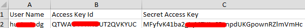

.. _ref_obtain_aksk:

Obtaining an AK/SK
=========================

.. toctree::
   :maxdepth: 10
   :includehidden:

If an AK/SK has already been generated, skip this step. Find the downloaded AK/SK file, which is usually named credentials.csv.

The following figure shows an AK and SK.

Important Notes
----------------

1. You can create a maximum of two access keys with identical permissions and unlimited validity.
   **Each access key can be downloaded only once when created**. Keep your access keys secure and change
   them periodically for security purposes. To change an access key, delete it and create a new one.

2. If you are an IAM user, hover over the username in the upper right corner of the management console,
   choose **Security Settings**, click the **Critical Operations** tab, and check the enabling status
   of the **Access Key Management** feature.

    - Disabled: All IAM users under the account can manage (create, enable, disable, and delete) their own access keys.
    - Enabled: Only the administrator can manage users' access keys.

3. If you cannot manage your access keys, request the administrator.

4. If you are an administrator, you can view the AK of an IAM user on the user details page. The SK is kept by the user.

Procedure
-----------------
1. Go to the console homepage.

2. Hover the cursor on the username and choose My Credentials from the drop-down list.

3. In the navigation pane, choose **Access Keys**.
 
4. Click **Create Access Key**.

   For newly created access keys, the last used time is the same as the creation time, but will change the next time you use them.

5. At the bottom of the dialog box, select "I have read the recommendations shown here and still want to create access keys."
   and click **Next**.

6. Enter a description, and click **OK**.

    - When creating an access key for an IAM user, you need to enter a verification code for identity authentication.
    - If operation protection is enabled, you need to enter a verification code for identity authentication when creating an access key for an IAM user.

7. In the displayed dialog box, click **Download** to save the access key.

   You can obtain the AK from the access key list and SK from the downloaded CSV file.

   - For details about how to obtain a temporary AK/SK, see :otc_docs:`Obtaining a Temporary AK/SK <identity-access-management/api-ref/apis/access_key_management/obtaining_a_temporary_ak_sk.html#en-us-topic-0097949518>`.
   - Keep the CSV file properly. You can only download the file right after the access key is created.
     However, if you cannot find the file to obtain the key information, you can create a key.
   - Open the CSV file in the lower left corner, or choose Downloads in the browser and open the CSV file.
   - Keep your access keys secure and change them periodically for security purposes.
